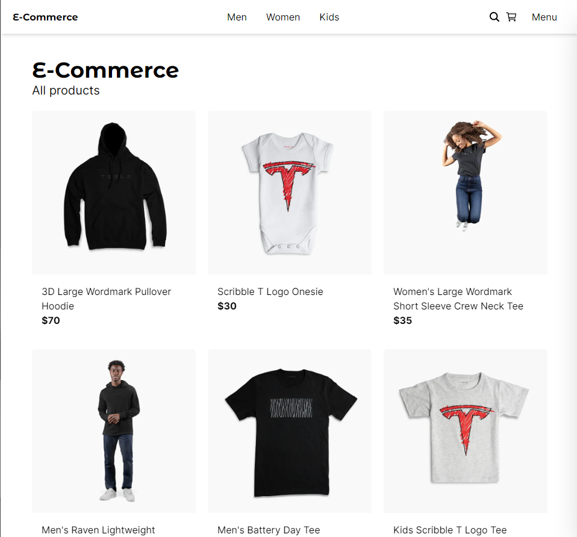
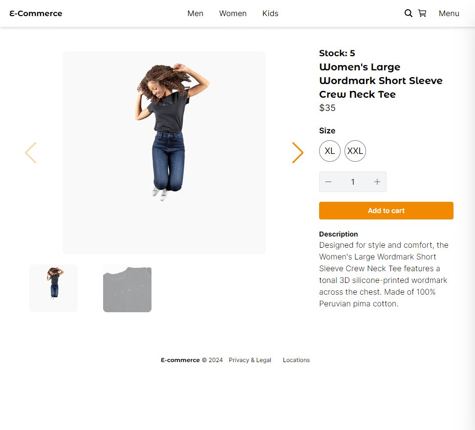
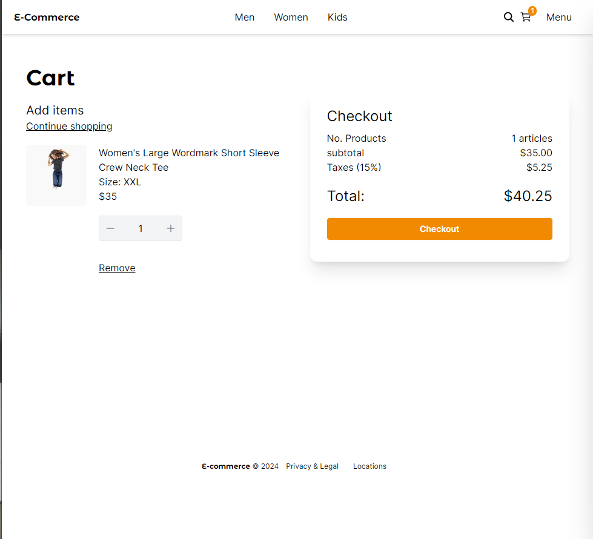
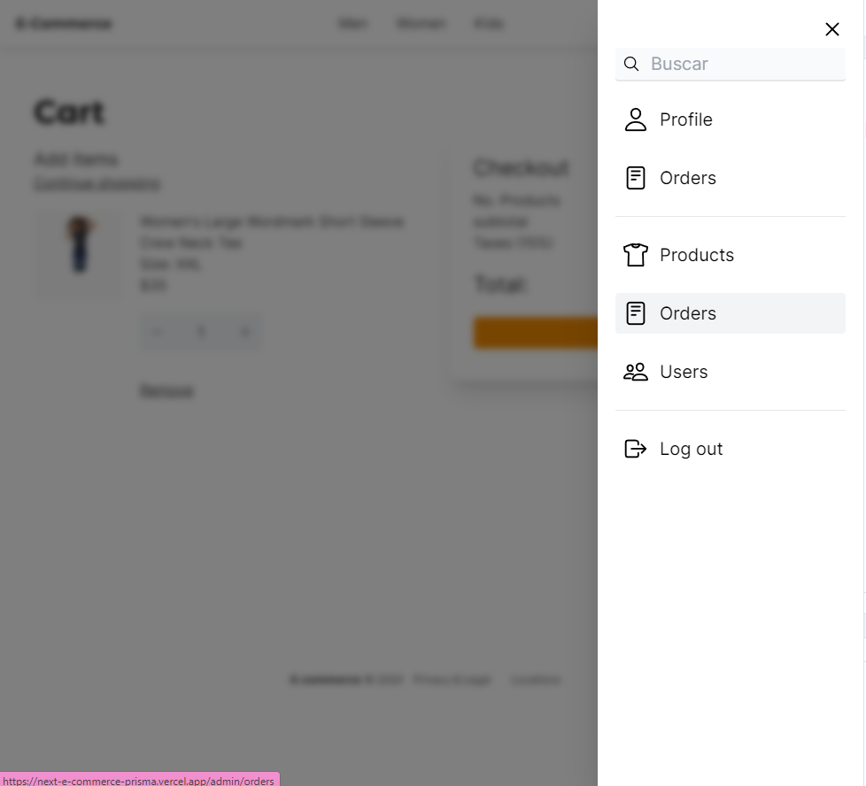

# Descripción
La app cuenta con roles como usuario y administrador.
Los administradores pueden cambiarle el rol a las personas resgistradas, visualizar la tabla de usuarios, de productos, de ordenes, agregar productos, modificarlos y eliminarlos.
Cualquier persona puede ver los productos y agregarlos al carrito de compras, pero para comprarlos debe estar registrado.

<div>
    
    
    
    
</div>

La app la realicé usando:
- Next.js, 
- Zustand para el manejo de los estados
- Tailwind para los estilos
- Postgresql como base de datos
- Prisma para hacer las peticiones SQL
- Docker
- PayPal


## Correr en dev
1. Clonar el repositorio
2. Crear una copia del ```.env.template``` y renombrarlo a ```.env``` y cambiar las variables de entorno
3. Istalar dependencias ```npm install```
4. Levantar la base de datos ```docker compose up -d```
5. Correr las migraciones de Prisma ```npx prisma migrate dev```
6. Ejecutar seed ```npm run seed```
7. Correr el proyecto ```npm run dev```
8. Limpiar el localStorage del navegador


